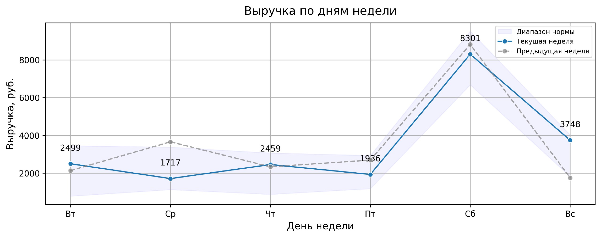
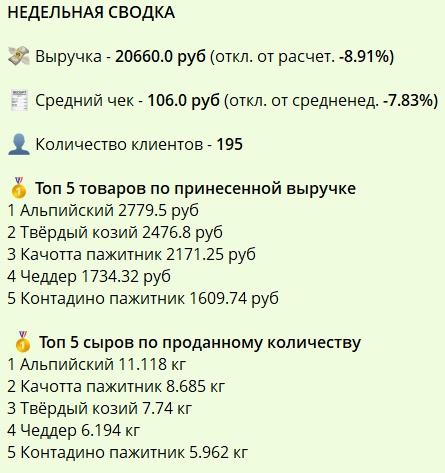

<h1 align="center"> Outlet Sales Weekly Report </h1>

## Stack

## Description

An automated report that delivers a weekly sales summary for one of our retail outlets every Monday at 9:00 a.m. The report is generated through an ETL pipeline that extracts the required data from a PostgreSQL database, applies transformations, creates visualizations, composes a text message, and sends the result to a Telegram channel using the Telegram API.

**Project Goal** - To provide weekly notifications to decision-makers with key sales figures from the main outlet.

## How it works

Every Monday at 9:00 a.m., decision-makers receive a message that includes a daily revenue chart for the past week.

Example:

  

The message also contains a summary text describing the main sales figures.

Example:

  
